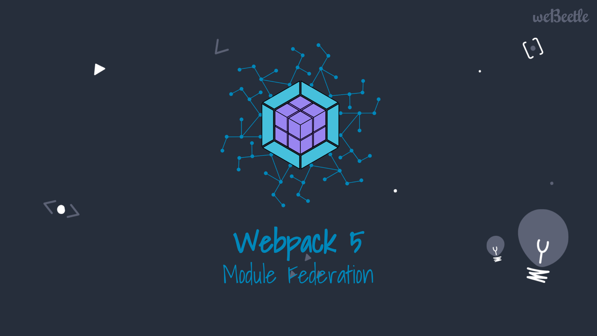

# Webpack 5 Federated Modules Example



I Moduli federati di Webpack 5 ci offrono un modo completamente nuovo per condividere codice in fase di esecuzione tra diverse applicazioni.

Questo repository mostra un esempio di utilizzo di come i moduli federati siano facili da usare.

Troverete l'articolo completo su Medium al seguente indirizzo:

[https://medium.com/webeetle](https://medium.com/webeetle)

```
HAPPY CODING!
```

## Installazione

```
$ yarn install && yarn install:all
```

## Esecuzione

```
$ yarn dev:all
```